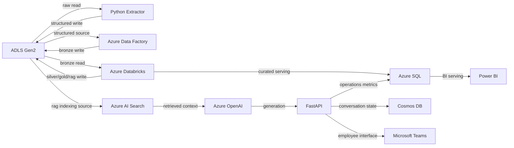
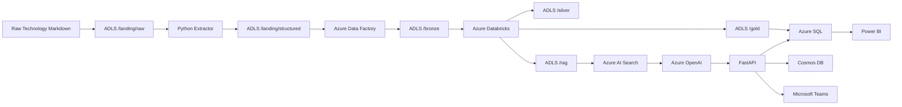
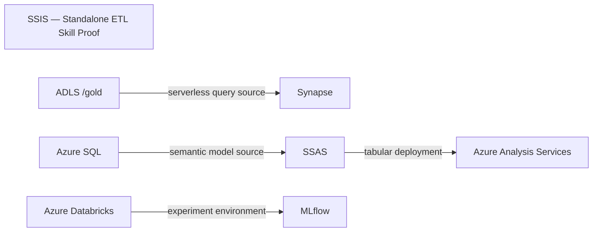

# TechScope Architecture

## 1. Architecture Principles

This is the live architecture document.

The authoritative frozen architecture contract is:

`docs/baselines/TechScope_Baseline_Architecture_Model_v1.2_FINAL_FROZEN.md`

Frozen Baseline files must not be modified.

## 2. Current MAIN Architecture

```mermaid
flowchart LR
```

## 3. Target MAIN Architecture



## 4. Target Key Data Flow



## 5. Skill Proof Flow



## 6. Component Responsibilities

Component responsibilities follow the Frozen Baseline.

## 7. Significant Decisions

Architecture decisions are stored under:

`docs/decisions/`
