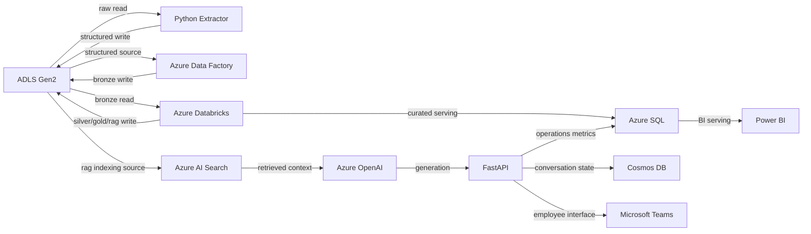
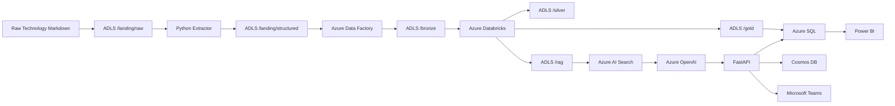
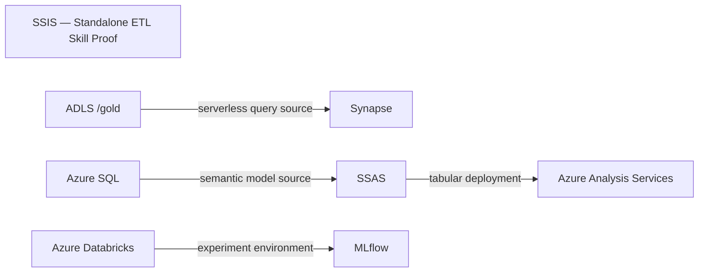

# TechScope — Data & AI Knowledge Ops

## Baseline Architecture Model v1.2 — FINAL / FROZEN

---

## 0. Baseline 선언

본 문서를 **TechScope Baseline Architecture Model v1.2 — FINAL / FROZEN**으로 고정한다.

## Baseline Versioning Contract

`v1.0`과 `v1.1`은 각각 확정 당시 상태를 보존하는 **불변 역사적 Baseline(immutable historical baseline)** 이다.

```text
TechScope Baseline Architecture Model v1.0 — FINAL / FROZEN
TechScope Baseline Architecture Model v1.1 — FINAL / FROZEN
→ 수정 금지
→ 덮어쓰기 금지
→ 각 버전의 freeze 시점 상태를 설명하는 historical record로 영구 보존
```

본 `v1.2`는 v1.1을 수정한 파일이 아니라, v1.1 FROZEN 이후 발견된 Baseline metadata/표현 정합성 변경을 반영해 **새로 re-baseline한 후속 Baseline**이다.

```text
v1.0 FINAL / FROZEN
   ↓ re-baseline
v1.1 FINAL / FROZEN
   ↓ re-baseline
v1.2 FINAL / FROZEN
```

v1.2에서 고정하는 추가 변경:

```text
1. RegistrySnapshot에 explicit freeze_time 기록
2. §71 수식 표기를 canonical LaTeX로 정리
3. §71의 비정상 제어문자 제거
```

2–3은 기존 Architecture 의미를 바꾸지 않는 표현/렌더링 정정이다. 그러나 v1.1 자체가 이미 FROZEN이므로 **v1.1 파일을 in-place 수정하지 않고 v1.2에 반영**한다.

Frozen Baseline 파일 자체는 의미 수정하지 않는다. 이후 Architecture contract 또는 Baseline metadata contract가 다시 바뀌면 현재 Frozen 파일을 고치는 대신 다음 버전으로 re-baseline한다.

```text
v1.2 change
→ ADR 또는 re-baseline decision
→ v1.3 re-baseline
```

반면 다음은 Frozen Baseline 파일 변경이 아니라 **현재 구현 상태를 관리하는 Live Operational Artifact 갱신**이므로 re-baseline이 필요하지 않다.

```text
L0 Implementation Artifact 갱신
Status 갱신
Implementation Evidence 갱신
Current MAIN 갱신
자동 실행 결과 / run report 갱신
```

설명·표현·레이아웃만 수정해야 하는 경우에도 historical Baseline 파일을 직접 고치지 않는다. 의미가 동일한 문서 정정은 Live Documentation에서 수행하고, 다음 re-baseline 시 반영한다.

본 Baseline 이후의 변경 원칙:

```text
단순 구현 진행
→ 자동/수동 Implementation 실행
→ Status / Implementation Evidence 동기화
→ Current MAIN 동기화 (MAIN만; SKILL_PROOF는 Current MAIN 대상 아님)

Non-semantic documentation correction
→ Live Documentation 수정
→ ADR 불필요
→ Frozen Baseline은 보존

Architecturally Significant Change
→ ADR
→ 다음 Baseline version으로 re-baseline
→ Target MAIN Architecture / Skill Proof Flow 등 해당 Architecture Intent 변경
→ Implementation
→ Implementation Evidence
→ Status
→ Current MAIN 갱신 (MAIN만)
```

즉 **FROZEN은 “더 이상 해당 파일을 고치지 않는다”는 역사적 불변성 계약**이며, 이후 변경은 항상 새 Baseline version에서만 반영한다.

---

# 1. 프로젝트 정의

**TechScope**는 기업의 Data·AI 기술자료를 Azure 기반 데이터 파이프라인으로 구조화하고, Data Mart와 Power BI로 분석하며, Azure OpenAI 기반 RAG를 통해 자연어 기술지원을 제공하고, AI 서비스의 운영 데이터를 다시 Power BI에서 분석하는 **End-to-End Data·AI Knowledge Ops PoC**다.

프로젝트의 실행 목표는 “사용자가 각 기술을 Portal에서 직접 하나씩 실습하며 구축”하는 것이 아니다.

> **가능한 전 과정을 코드와 자동화 Workflow로 구축·배포·실행·검증·증거화하고, 사용자는 결과 위치·수정 위치·수동 재실행 방법만 알면 되는 Automation-First 구조를 기본으로 한다.**

따라서 기본 운영 방식은 다음이다.

```
Source / Config 수정
      ↓
Single Entry Point 실행
      ↓
Preflight / Validation
      ↓
Provision / Deploy
      ↓
Seed / Execute
      ↓
Verify / Evidence Collect
      ↓
Status / Current MAIN Sync
      ↓
Result Report
```

수동 작업은 기술적으로 자동화할 수 없거나, Tenant Admin 승인·Subscription 권한·License/Capacity·Quota/Region availability·로컬 관리자 설치처럼 **외부 권한 경계에서만 예외적으로 허용**한다. 이 경우 자동화가 중단 이유, 필요한 수동 조작, 확인 위치, 완료 후 resume 명령을 결과물로 생성하도록 한다.

메인 Runtime에서 실제 서비스 흐름을 구현하는 동시에, 지원 직무에서 요구되는 기술 중 메인 Runtime에 억지로 넣을 필요가 없는 기술은 **Skill Proof Flow**에서 독립적으로 실행·증거화한다. Skill Proof 역시 가능한 범위에서는 동일한 Automation-First 원칙을 적용한다.

`EvidenceBackedLivingArchitecture`를 Architecture Knowledge Validation capability의 canonical 명칭으로 사용한다.

# [ \boxed{ TechScope

DataAIProduct
\+
TechnicalSkillProof
\+
EvidenceBackedLivingArchitecture
\+
AutomationFirstDelivery
}
]

---

# 2. L0 / L1 / L2 계층

```
┌───────────────────────────────────────────────────────┐
│ L2 — Architecture Knowledge & Validation Layer        │
│                                                       │
│ architecture.md                                       │
│ status.md                                             │
│ evidence.md                                           │
│ ADR                                                   │
│                                                       │
│ architecture_lint.py                                  │
│ GitHub Actions                                        │
└───────────────────────┬───────────────────────────────┘
                        │
       describes / validates repository and
       architecture-documentation integrity
                        │
                        ▼
┌───────────────────────────────────────────────────────┐
│ L1 — TechScope Architecture Model                     │
│                                                       │
│ Current MAIN Architecture                             │
│ Target MAIN Architecture                              │
│ Target Key Data Flow                                  │
│ Skill Proof Flow                                      │
└───────────────────────┬───────────────────────────────┘
                        │
                   realized by
                        ▼
┌───────────────────────────────────────────────────────┐
│ L0 — Actual Implementation                            │
│                                                       │
│ Azure Resources                                       │
│ Python / Spark / SQL / API                            │
│ ADF / ADLS / Databricks                               │
│ Azure SQL / Power BI                                  │
│ AI Search / Azure OpenAI / Teams                      │
│ Runtime Data / Logs / Outputs                         │
└───────────────────────────────────────────────────────┘

```

### L2의 한계

L2는 Azure Runtime을 독립적으로 인증하지 않는다.

예를 들어 `pipeline-success.png`가 존재한다고 해서 `architecture_lint.py`가 Azure API에 접속하여 해당 실행의 진위를 다시 확인하는 것은 아니다.

L2가 보장하는 범위:

```
Implementation Claim
        ↓
Required Implementation Evidence Registry
        ↓
Referenced Artifact Exists
        ↓
Status / Architecture / ADR internally consistent

```

즉 **Evidence-backed repository integrity**를 검증한다.

> **Baseline v1.2 lint는 Mermaid cardinality, Architecture Node membership, Track/Scope/Status, reference integrity, Implementation Evidence completeness/path existence, ADR integrity를 검증하며, Mermaid Edge runtime connectivity 및 Mermaid Edge semantic correctness를 독립적으로 검증하지 않는다.**

---


# 2.1. Automation & Operations Plane

Automation은 MAIN Runtime의 새로운 `CMP_*` Component가 아니라, L0/L1/L2를 **구축·실행·검증하는 cross-cutting delivery plane**이다.

```
┌──────────────────────────────────────────────────────────┐
│ Automation & Operations Plane                            │
│                                                          │
│ GitHub Actions / OIDC                                    │
│ tools/techscope.py                                       │
│ Bicep + Azure CLI                                        │
│ ADF automated publish                                    │
│ Databricks Declarative Automation Bundles                │
│ SQL Project / SqlPackage                                 │
│ Azure AI Search REST/SDK                                 │
│ PBIP + Fabric REST API                                   │
│ Microsoft 365 Agents Toolkit CLI                         │
│ Evidence / Status / Current MAIN synchronization         │
└──────────────────────┬───────────────────────────────────┘
                       │ provisions / deploys / runs /
                       │ verifies / collects / reports
                       ▼
                 L0 / L1 / L2
```

따라서 위 자동화 도구는 `Component Registry`에 추가하지 않는다. 서비스 Runtime topology 자체가 아니라 **delivery/operations mechanism**이기 때문이다.

## Canonical Automation Entry Point

사용자가 기억해야 하는 기본 명령은 하나로 제한한다.

```
python tools/techscope.py all --env dev
```

동일 동작은 GitHub Actions의 manual `workflow_dispatch`에서 **Run workflow** 한 번으로 실행할 수 있게 한다.

`all`의 canonical 순서:

```
preflight
→ lint
→ plan
→ provision
→ deploy
→ seed
→ run-main
→ run-skill-proof
→ verify
→ collect-evidence
→ sync-docs
→ report
```

각 단계는 가능한 한 **idempotent / restartable**하게 만든다.

실패가 외부 권한/Quota/License 같은 수동 Gate 때문이면:

```
results/latest/manual-actions.md
```

를 생성하고, 완료 후:

```
python tools/techscope.py resume --env dev
```

로 중단 지점부터 재개하는 것을 기본 계약으로 한다.

## Automation Priority

```
A — Fully Automated
    코드/CLI/API/IaC만으로 구축·실행·검증

B — Automated After One-Time Prerequisite
    로그인, 권한 승인, Tenant 설정 등 1회 선행조건 후 자동화

C — Manual Required
    공식 API/CLI 부재 또는 조직 정책 때문에 자동화 불가한 최소 작업
```

항상 `A → B → C` 순으로 방법을 찾으며, 수동 Portal 조작은 기본 경로가 아니라 **최후의 fallback**이다.

## Current Official Automation Mechanisms

v1.2 re-baseline 시점의 기본 구현 선택:

| 영역 | 기본 자동화 경로 |
| --- | --- |
| Azure Resource provisioning | Bicep + Azure CLI, 필요 시 `what-if` |
| ADLS seed/upload | Azure CLI / AzCopy |
| ADF | automated publish + generated ARM deployment + pipeline trigger |
| Databricks | Declarative Automation Bundles deploy/run |
| Azure SQL | SQL Project → DACPAC → SqlPackage publish |
| Azure AI Search | REST/SDK로 index/data source/indexer 생성·실행 |
| Azure OpenAI / Foundry resource | Bicep/ARM/CLI 기반 resource/model deployment |
| Cosmos DB | Bicep로 account/database/container 관리 |
| Power BI | source-controlled PBIP + Fabric REST API 배포 |
| Teams | Microsoft 365 Agents Toolkit CLI provision/deploy/CI-CD |
| GitHub → Azure auth | OIDC workload identity federation 우선 |

이 표의 **구체 CLI 문법이나 도구 버전은 구현 세부사항**이며 업데이트될 수 있다. Automation-First라는 Architecture contract와 Single Entry Point contract가 유지되는 한, 도구 버전 변경 자체는 re-baseline 사유가 아니다.

---
# 3. ID Namespace

| Namespace | 의미 | 관리 위치 |
| --- | --- | --- |
| `CMP_*`          | Architecture Component             | `status.md`             |
| `ZONE_*`         | Component 내부 Logical Data Location | `architecture.md`       |
| `T*`             | Domain Technology                  | Data Mart               |
| `CAT*`           | Domain Category                    | Data Mart / RAG         |
| `COM*`           | Domain Company                     | Data Mart / RAG         |
| `SRC*`           | Domain Source                      | Data Mart / RAG         |
| `CH*`            | RAG Chunk                          | RAG Dataset / AI Search |
| `EVD-*`          | Implementation Evidence            | `evidence.md`           |
| `ADR-*`          | Architecture Decision Record       | `docs/decisions/`       |

---

# 4. Architecture Entity와 Domain Entity 분리

```
CMP_ADF

```

\= 우리가 실제 구축한 Azure Data Factory Architecture Component.

```
T001

```

\= TechScope 지식 데이터 안에서 관리되는 Azure Data Factory라는 Domain Technology.

따라서:

[
CMP\_ADF \neq T001
]

이다.

---

# 5. Raw Source는 Component가 아니다

원본 Markdown:

```
SRC001

```

로 관리한다.

Source는 실행 가능한 Component가 아니므로 `CMP_SOURCE`를 만들지 않는다.

Data lineage:

```
SRC001
  ↓
ZONE_ADLS_RAW
  ↓
CMP_PYTHON

```

---

# 6. Raw Zone 표현

`ZONE_ADLS_RAW`는:

> **Logically Immutable Raw Zone**

으로 정의한다.

의미:

```
프로젝트 운영 규칙상
원본 파일을 overwrite / update하지 않음

```

이다.

Azure Storage의 실제 WORM/Immutable Storage Policy를 설정하지 않았다면 **물리적 또는 정책적 Immutable Storage를 구현했다고 표현하지 않는다.**

---

# 7. Component Registry

## MAIN

```
CMP_ADLS
CMP_PYTHON
CMP_ADF
CMP_DATABRICKS
CMP_AZURE_SQL
CMP_POWER_BI
CMP_AI_SEARCH
CMP_AZURE_OPENAI
CMP_FASTAPI
CMP_COSMOS
CMP_TEAMS

```

## SKILL\_PROOF

```
CMP_SSIS
CMP_SYNAPSE
CMP_SSAS
CMP_AAS
CMP_MLFLOW

```

이 절의 목록은 Baseline freeze 시점의 **Registry snapshot**이다. 운영 중 Component ID / Track / Scope / Status의 authoritative source는 `status.md`이며, 이 snapshot은 freeze 시점의 `status.md`를 Track별로 분할한 point-in-time copy다.

Registry snapshot metadata:

```yaml
baseline_version: v1.2
freeze_time: 2026-08-15T10:34:00+09:00
timezone: Asia/Seoul
source: docs/status.md
semantics: point-in-time immutable snapshot
```

따라서 `RegistrySnapshot`은 live `status.md`와 계속 동일해야 한다는 뜻이 아니라, **freeze_time에 관측된 `status.md` 상태와 동일해야 한다.** Freeze 이후 `status.md`가 구현 진행에 따라 바뀌어도 해당 Frozen snapshot은 갱신하지 않는다.

\[
t_f = \text{2026-08-15T10:34:00+09:00}
\]

\[
RegistrySnapshot_{v1.2,t_f}
=
Partition(status.md@t_f, Track)
\]

---

# 8. Component Metadata

각 Component는 세 개의 독립 차원을 가진다.

```
Component
│
├─ Track
├─ Scope
└─ Status

```

## Track

```
MAIN
SKILL_PROOF

```

## Scope

```
REQUIRED
OPTIONAL

```

## Status

```
Planned
In Progress
Implemented
Prototype
Blocked

```

`Skill Proof`와 `Optional`은 Status가 아니다.

---

# 9. `status.md`

Schema:

```
# Implementation Status

| Component ID | Component | Track | Scope | Status |
|---|---|---|---|---|
| CMP_ADLS | ADLS Gen2 | MAIN | REQUIRED | Planned |
| CMP_PYTHON | Python Extractor | MAIN | REQUIRED | Planned |
| CMP_ADF | Azure Data Factory | MAIN | REQUIRED | Planned |
| CMP_DATABRICKS | Azure Databricks | MAIN | REQUIRED | Planned |
| CMP_AZURE_SQL | Azure SQL | MAIN | REQUIRED | Planned |
| CMP_POWER_BI | Power BI | MAIN | REQUIRED | Planned |
| CMP_AI_SEARCH | Azure AI Search | MAIN | REQUIRED | Planned |
| CMP_AZURE_OPENAI | Azure OpenAI | MAIN | REQUIRED | Planned |
| CMP_FASTAPI | FastAPI | MAIN | REQUIRED | Planned |
| CMP_COSMOS | Cosmos DB | MAIN | REQUIRED | Planned |
| CMP_TEAMS | Microsoft Teams | MAIN | REQUIRED | Planned |
| CMP_SSIS | SSIS | SKILL_PROOF | REQUIRED | Planned |
| CMP_SYNAPSE | Synapse | SKILL_PROOF | REQUIRED | Planned |
| CMP_SSAS | SSAS | SKILL_PROOF | REQUIRED | Planned |
| CMP_AAS | Azure Analysis Services | SKILL_PROOF | REQUIRED | Planned |
| CMP_MLFLOW | MLflow | SKILL_PROOF | REQUIRED | Planned |

```

`status.md`가 Component ID, Track, Scope, Status를 포함한 Component Registry의 **Single Source of Truth**다.

---

# 10. ADLS Component와 Zone

ADLS는 하나의 Component다.

```
CMP_ADLS

```

내부 Logical Data Location:

```
CMP_ADLS
│
├─ ZONE_ADLS_RAW
│   └─ /landing/raw
│
├─ ZONE_ADLS_STRUCTURED
│   └─ /landing/structured
│
├─ ZONE_ADLS_BRONZE
│   └─ /bronze
│
├─ ZONE_ADLS_SILVER
│   └─ /silver
│
├─ ZONE_ADLS_GOLD
│   └─ /gold
│
└─ ZONE_ADLS_RAG
    └─ /rag

```

`ZONE_*`은 Component가 아니므로 다음 항목을 갖지 않는다.

```
Track
Scope
Status
Implementation Evidence completeness

```

---

# 11. `architecture.md`의 View

```
# TechScope Architecture

## 1. Architecture Principles

## 2. Current MAIN Architecture
   - CMP_* only
   - Mermaid block exactly 1
   - zero CMP_* nodes allowed when Current MAIN is empty

## 3. Target MAIN Architecture
   - CMP_* only
   - Mermaid block exactly 1

## 4. Target Key Data Flow
   - SRC* / ZONE_* / CMP_*
   - Mermaid block exactly 1

## 5. Skill Proof Flow
   - CMP_* / ZONE_*
   - MAIN dependencies allowed
   - Mermaid block exactly 1

## 6. Component Responsibilities

## 7. Significant Decisions

```

---

# 12. Mermaid Parsing 규칙

`architecture_lint.py`는 `architecture.md` 전체에서 단순 Regex로 ID를 수집하지 않는다.

**지정된 Heading 바로 아래의 Mermaid fenced block만 Architecture View로 파싱한다.**

각 View:

```
Current MAIN Architecture
Target MAIN Architecture
Target Key Data Flow
Skill Proof Flow
```

는 정확히 **하나의 Mermaid block**을 가져야 한다.

단, `Current MAIN Architecture`는 구현 초기 상태를 표현하기 위해 **0개의 `CMP_*` Node를 가진 Empty Current MAIN View를 허용**한다.

Canonical empty representation:

```mermaid
flowchart LR
```

즉 “Empty”는 Mermaid block 자체를 생략한다는 뜻이 아니라:

```
Mermaid block = exactly 1
CMP_* node count = 0 allowed
edge count = 0 allowed
```

이라는 뜻이다.

Target MAIN / Target Key Data Flow / Skill Proof Flow는 각각의 membership/completeness contract를 그대로 적용한다.

본문의 `CMP_SSAS` 같은 일반 텍스트는 Architecture Membership으로 간주하지 않는다.

---

# 13. Current MAIN Architecture

정의:

> 실제로 구현됐다고 주장하는 MAIN Component 관계.

허용 Node:

```
CMP_*
```

허용 Status:

```
Implemented
Prototype
```

불변조건:

[
CurrentMain(x)
\Rightarrow
Track(x)=MAIN
\land
Status(x)\in{Implemented,Prototype}
]

따라서 `SKILL_PROOF` Component는 Status가 `Implemented` 또는 `Prototype`이어도 Current MAIN에 들어갈 수 없다.

## Empty Current MAIN

아직 Current MAIN에 표시할 Component가 없으면 다음 View를 유효한 상태로 허용한다.

```mermaid
flowchart LR
```

Empty Current MAIN은 “아키텍처가 없다”가 아니라 **현재 구현됐다고 주장하는 MAIN relation/node가 아직 없다는 상태**다.

Prototype은 포함 선택 사항이므로 `MAIN + Prototype`만 존재할 때 Current MAIN이 Empty일 수 있다. 반면 `MAIN + Implemented`가 하나라도 존재하면 `# 14. Current MAIN Completeness` 때문에 Empty Current MAIN은 허용되지 않는다.

---

# 14. Current MAIN Completeness

MAIN + Implemented Component는 Current MAIN에서 누락될 수 없다.

[
Track(x)=MAIN
\land
Status(x)=Implemented
\Rightarrow
x\in CurrentMain
]

Prototype은 Current MAIN 포함을 강제하지 않는다.

---

# 15. Target MAIN Architecture

정의:

> TechScope MAIN Runtime의 Architecture Intent.

허용 Node:

```
CMP_*

```

그리고:

[
x\in TargetMain
\Rightarrow Track(x)=MAIN
]

Target MAIN의 completeness를 위해 반대 방향도 강제한다.

[
Track(x)=MAIN
\Rightarrow x\in TargetMain
]

따라서 Target MAIN Component membership은 다음과 같이 완전 대응한다.

[
x\in TargetMain
\iff Track(x)=MAIN
]

반대로:

[
Track(x)=SKILL\_PROOF
\Rightarrow x\notin TargetMain
]

이다.

현재 Scope가 `OPTIONAL`이어도 `Track=MAIN`으로 Registry에 등록되어 있다면 Target MAIN에는 표시한다.

---

# 16. Target MAIN Component 관계



Component View는 **Component relation view**이며 정확한 processing chronology 자체를 표현하지 않는다.

---

# 17. Target Key Data Flow

정의:

> 주요 Source/Zone lineage와 Component I/O를 표현하는 **Target View**.

허용 Node:

```
SRC*
ZONE_*
CMP_*

```

주의:

> Databricks 내부의 세부 `Silver → Gold/RAG` Transformation chronology는 이 Diagram에서 완전하게 모델링하지 않는다.

세부 Transformation은 Databricks Notebook Implementation Artifact에서 관리한다.

Target Key Data Flow는 MAIN Runtime의 Target View이므로, 이 View에 등장하는 `CMP_*`는 모두 `Track=MAIN`이어야 한다.

[
x\in TargetKeyDataFlow
\land Component(x)
\Rightarrow Track(x)=MAIN
]

따라서 `SKILL_PROOF` Component는 Target Key Data Flow에 들어가지 않는다.

---

# 18. Target Key Data Flow



논리적 내부 Data Engineering 순서는:

```
Bronze
 ↓
Transformation
 ↓
Silver
 ↓
Curation
 ├─→ Gold
 └─→ RAG Dataset

```

로 이해한다.

---

# 19. Skill Proof Flow

기존 `Skill Proof Architecture` 명칭을 **Skill Proof Flow**로 변경한다.

이유:

Skill Proof Component가 MAIN Component와 Zone을 입력 dependency로 재사용하기 때문이다.

허용 Node:

```
CMP_*
ZONE_*

```

MAIN dependency 참조를 허용한다.

---

# 20. Skill Proof 불변조건

기존의 잘못된 규칙:

[
SkillProofFlow(x)\Rightarrow Track(x)=SKILL\_PROOF
]

은 사용하지 않는다.

대신:

[
Track(x)=SKILL\_PROOF
\Rightarrow x\notin TargetMain
]

[
Track(x)=SKILL\_PROOF
\Rightarrow x\notin TargetKeyDataFlow
]

그리고 REQUIRED Skill Proof Component에 대해:

[
Track(x)=SKILL\_PROOF
\land Scope(x)=REQUIRED
\Rightarrow x\in SkillProofFlow
]

를 사용한다.

Skill Proof Flow 안의 MAIN Component는 **dependency reference**다.

---

# 21. Skill Proof Flow



※ SSIS 내부 Data Flow의 세부 Source/Destination은 Implementation Artifact에서 표현한다.

---

# 22. Python 책임

Python:

```
Raw Markdown
 ↓
Minimum Structural Extraction

```

수행:

```
Markdown parsing
Table/row recognition
Minimal field extraction
Basic structural validation

```

출력:

```
technology.csv
category.csv
relation.csv
company_usecase.csv
architecture_mapping.csv

```

수행하지 않음:

```
Final normalization
Technology ID resolution
Complex joins
Aggregation
Gold creation
RAG chunk generation

```

---

# 23. ADF 책임

Pipeline:

```
PL_Ingest_TechScope

```

흐름:

```
ZONE_ADLS_STRUCTURED
       ↓
Get Metadata
       ↓
ForEach
       ↓
Copy Activity
       ↓
ZONE_ADLS_BRONZE

```

---

# 24. Databricks 책임

Databricks/Spark:

```
Load
Clean
Normalize
Deduplicate
Resolve IDs
Explode
Join
Aggregate
Spark SQL
Partition
Silver creation
Gold creation
RAG dataset creation

```

실제 사용 기능:

```
select
filter
withColumn
dropDuplicates
explode
join
groupBy
agg
repartition
Spark SQL

```

Distributed Computing 확인:

```
getNumPartitions()
repartition()
Spark Job
Stage
Task

```

---

# 25. Medallion-style Data Layer

```
ZONE_ADLS_RAW
Logically immutable source copy

ZONE_ADLS_STRUCTURED
Minimum extracted structure

ZONE_ADLS_BRONZE
ADF-ingested data

ZONE_ADLS_SILVER
Cleaned / normalized / ID-resolved data

ZONE_ADLS_GOLD
Curated analytical data

ZONE_ADLS_RAG
Retrieval-oriented chunks + metadata

```

---

# 26. Gold / Azure SQL 역할

```
ZONE_ADLS_GOLD
Curated Analytical Layer
      ↓
CMP_AZURE_SQL
Serving Data Mart
      ↓
CMP_POWER_BI

```

Gold는 Data Engineering 결과.

Azure SQL은 relational BI Serving Layer.

이 선택은 ADR-002로 관리한다.

---

# 27. Data Mart

## Dimension

```
DimTechnology
DimCategory
DimArchitectureLayer
DimCompany
DimEvidenceType
DimSource
DimDate

```

## Fact

```
FactTechnologyRelation
FactCompanyTechnology
FactArchitectureMapping
FactAIRequest

```

## Bridge

```
BridgeAIRequestTechnology

```

---

# 28. FactAIRequest 수정

`technology_key`를 Fact에서 제거한다.

한 AI Request가 여러 Technology를 참조할 수 있기 때문이다.

최종:

```
FactAIRequest
├─ request_key
├─ request_id
├─ request_timestamp
├─ status
├─ latency_ms
├─ retrieved_chunk_count
├─ citation_flag
├─ feedback_score
├─ error_type
└─ model_name

```

---

# 29. AI Request ↔ Technology 관계 — Grounding Technology Contract

`BridgeAIRequestTechnology`의 의미를 다음 하나로 고정한다.

> **BridgeAIRequestTechnology = AI Request가 최종 응답 생성 시 제공받은 authoritative grounding context에 의해 grounded 된 Domain Technology 관계.**

Canonical semantic relation name:

```
RequestGroundedByTechnology
```

따라서 이 Bridge는 다음 의미가 아니다.

```
질문에 단순 언급된 Technology
LLM 답변에 자유 생성으로 언급된 Technology
AI Search가 최초 후보로 반환했지만 grounding prompt에서 제외된 Technology
사용자 관심 Technology tag
일반적인 Request Subject classification
```

관계:

```
FactAIRequest
      │
      │ 1:N
      ▼
BridgeAIRequestTechnology
      │  Grounding Technology relation
      │ N:1
      ▼
DimTechnology
```

`BridgeAIRequestTechnology`:

```
request_key
technology_key
```

여기서 `technology_key`는 Data Mart surrogate key이고, RAG metadata의 `technology_ids`는 `T*` Domain ID다. 둘을 동일 ID로 취급하지 않는다.

## Grounding Chunk Set

`GroundingChunkSet(request)`는 AI Search의 최초 Search Hit 전체가 아니라:

> **validation/filtering 후 실제 최종 grounding context로 Azure OpenAI에 전달된 Chunk 집합**

이다.

Request별 authoritative Grounding Technology ID 집합은 해당 Chunk metadata에서만 유도한다.

[
GroundingTechnologyIds(r)
=
ValidateDomainIds(
\bigcup_{c\in GroundingChunkSet(r)} c.technology\_ids
)
]

Domain Technology Resolver는 이 집합의 **canonicalization / validation / alias resolution**에 사용할 수 있지만, grounding Chunk와 연결되지 않은 Technology를 임의로 추가하는 Source of Truth가 될 수 없다.

즉 Resolver의 허용 역할:

```
Chunk metadata T* validation
alias/name → canonical T* normalization
invalid/deprecated T* rejection or canonical replacement
```

금지 역할:

```
질문 텍스트만 보고 별도 Technology 추가
LLM candidate ID를 grounding relation으로 승격
검색되지 않은 Technology를 Bridge에 삽입
```

`DimTechnology`의 최소 identity contract:

```
technology_key   -- Data Mart surrogate key
technology_id    -- unique T* Domain ID
technology_name  -- canonical display name
```

그 뒤 서버가 `DimTechnology.technology_id`를 기준으로 `technology_key`를 resolve한다.

```
Grounding Chunks
      ↓
grounding technology_ids
      ↓
Domain validation / canonicalization
      ↓
DimTechnology lookup
      ↓
technology_key
      ↓
BridgeAIRequestTechnology
```

즉:

[
BridgeTechnologyKey
=
Resolve_{DimTechnology}(GroundingTechnologyId)
]

그리고 Bridge row 존재 조건을 다음처럼 고정한다.

[
Bridge(r,t)=1
\iff
t\in GroundingTechnologyIds(r)
]

LLM이 자유 생성한 Domain ID 또는 surrogate key를 `BridgeAIRequestTechnology`의 DB Foreign Key로 직접 저장하지 않는다.

동일한 `GroundingTechnologyIds` 집합을 API Response의 `technologyIds`와 Cosmos persistence에도 사용한다. 따라서 세 표현의 의미가 drift하지 않는다.

```
Grounding Chunks
      ↓
GroundingTechnologyIds
      ├────────→ Response technologyIds
      ├────────→ Cosmos technologyIds
      └→ DimTechnology → technology_key
                         ↓
              BridgeAIRequestTechnology
```

예:

```
Request Q001
"ADF와 SSIS 차이가 뭐야?"

GroundingChunkSet(Q001):
CH001 → T001 Azure Data Factory
CH005 → T002 SSIS

Logical Grounding mapping:
Q001 grounded by T001
Q001 grounded by T002

Physical Bridge storage:
request_key(Q001) → technology_key(T001 resolved row)
request_key(Q001) → technology_key(T002 resolved row)
```

Power BI에서 이 Bridge를 사용하는 분석의 정확한 의미도:

```
Grounded Requests by Technology
```

이다. 단순한 “질문 주제별 Request 수”로 해석하지 않는다.

---

# 30. Domain Evidence

`DIRECT / INDIRECT`는:

> **Domain Evidence Provenance / Confirmation Level**

이다.

Technology 자체가 아니라 Claim/Relation에 귀속한다.

예:

```
ADF → ADLS
DIRECT

```

```
ADF → CDC
INDIRECT

```

`INDIRECT`는 거짓이라는 뜻이 아니다.

Domain Evidence의 `DIRECT / INDIRECT`와 Implementation Evidence의 `SOURCE / EXECUTION / OUTPUT`은 서로 다른 Evidence system이며 혼용하지 않는다.

---

# 31. RAG Chunk Schema

Technology ID와 Name을 구분한다.

```
{
  "chunk_id": "CH001",
  "content": "Azure Data Factory는 ...",

  "technology_ids": [
    "T001"
  ],

  "technology_names": [
    "Azure Data Factory"
  ],

  "category_ids": [
    "CAT002"
  ],

  "category_names": [
    "Data Integration / ETL"
  ],

  "architecture_layers": [
    "Data Integration"
  ],

  "evidence_type": "DIRECT",

  "company_ids": [
    "COM001"
  ],

  "company_names": [
    "Example Company"
  ],

  "source_id": "SRC001"
}

```

---

# 32. RAG Field Contract

RAG Dataset / Azure AI Search의 canonical storage field는 `snake_case`, FastAPI Response의 transport field는 `camelCase`를 사용한다. 표기법만 다르며 의미 계약은 동일하다.

## `technology_ids`

`T*` Domain Technology ID를 저장한다.

용도:

```
Exact filtering
Stable references
Domain Technology validation / resolution
GroundingChunkSet에 속한 Chunk인 경우 Bridge technology_key derivation input

```

`technology_ids`를 `BridgeAIRequestTechnology.technology_key`로 직접 저장하지 않는다. 또한 모든 Search Hit의 `technology_ids`가 Bridge 대상인 것도 아니다. `# 29`의 `GroundingChunkSet`에 포함된 Chunk의 Technology ID만 Grounding Technology 후보가 되며, 서버가 이를 검증한 뒤 `DimTechnology`의 surrogate `technology_key`로 resolve한다.

## `technology_names`

용도:

```
Full-text search
Display
Prompt context
Human-readable output

```

## Category / Company ID-Name pair

Category와 Company에도 동일한 ID-Name dual-field contract를 **항상** 적용한다.

```
category_ids   ↔ category_names
company_ids    ↔ company_names
```

ID는 stable reference/filtering용, Name은 search/display용이다.

## `architecture_layers`

`DimArchitectureLayer`의 canonical display value만 사용한다. 자유 동의어를 섞지 않는다.

예:

```
Data Integration
```

`Integration`과 `Data Integration`처럼 동일 의미를 서로 다른 문자열로 저장하지 않는다.

## `evidence_type`

RAG의 `evidence_type`은 **Domain Evidence**이며 허용 값은:

```
DIRECT
INDIRECT
```

이다. 이는 Implementation Evidence의 `SOURCE / EXECUTION / OUTPUT`과 다른 계약이다.

---

# 33. Evidence-homogeneous Chunk Rule

Chunk 하나에는 하나의 `evidence_type`만 둔다.

따라서:

> **하나의 Chunk 안에는 동일 Confirmation Level의 Claim만 포함한다.**

금지:

```
CH001
 ├─ DIRECT claim
 └─ INDIRECT claim

```

허용:

```
CH001 = DIRECT claims only
CH002 = INDIRECT claims only

```

이 규칙으로 Claim-level Evidence Provenance가 RAG 단계에서 손실되지 않는다.

---

# 34. Azure AI Search Schema

```
chunk_id
content

technology_ids
technology_names

category_ids
category_names

architecture_layers
evidence_type

company_ids
company_names

source_id
content_vector

```

Azure AI Search Blob indexer는 newline-delimited JSON을 여러 Search Document로 분리하는 `jsonLines` parsing mode를 지원하므로 `knowledge_chunks.jsonl`을 그대로 Indexing Source로 사용하는 구조가 가능하다. 별도 Architecture Component를 추가할 필요는 없다.

---

# 35. RAG 방식

PoC에서는 Classic RAG를 사용한다.

아래 Flow는 **grounding data path**를 표현한다. 실제 request/control orchestration은 `CMP_FASTAPI`가 수행하며, `AI Search → Azure OpenAI` 화살표는 직접 네트워크 호출을 의미하지 않고 Retrieved Context가 OpenAI prompt로 전달되는 논리 흐름을 의미한다.

```
ZONE_ADLS_RAG
 ↓
Azure AI Search
 ↓
Azure OpenAI
 ↓
FastAPI

```

Microsoft는 현재 신규·복잡한 RAG에서는 agentic retrieval을 권장하지만, **GA 기능만 필요하거나 단순성·속도·직접 orchestration 제어가 우선인 경우 classic RAG를 명시적인 선택지로 유지**하고 있다. 따라서 하루짜리 Time-boxed PoC에서 classic RAG를 사용하는 ADR-004는 타당하다.

---

# 36. RAG Response Contract

```
{
  "answer": "...",

  "architectureLayers": [
    "Data Integration"
  ],

  "technologyIds": [
    "T001",
    "T003"
  ],

  "technologyNames": [
    "Azure Data Factory",
    "ADLS Gen2"
  ],

  "evidenceTypes": [
    "DIRECT",
    "INDIRECT"
  ],

  "flow": "Structured → ADF → Bronze → Databricks",

  "sources": [
    {
      "sourceId": "SRC001",
      "chunkId": "CH001",
      "evidenceType": "DIRECT"
    },
    {
      "sourceId": "SRC001",
      "chunkId": "CH005",
      "evidenceType": "INDIRECT"
    }
  ]
}

```

Response metadata는 LLM 자유 생성값이 아니라 서버가 Grounding Chunk metadata를 기준으로 조립·검증한다. `technologyIds`는 `# 29`의 Grounding Technology contract를 따른다.

Canonical derivation:

```
technologyIds
= GroundingTechnologyIds

technologyNames
= DimTechnology / validated metadata에서 technologyIds에 대응해 resolve

architectureLayers
= grounding에 사용된 Chunk의 canonical architecture_layers 집합

sources[]
= grounding에 사용된 Chunk별 sourceId + chunkId + evidenceType

evidenceTypes
= distinct(sources[].evidenceType)
```

따라서 `evidenceTypes`는 단순 참고값이 아니라 `sources[]`에서 **결정적으로 유도되는 summary**다.

[
Set(evidenceTypes)
=
Set(sources[].evidenceType)
]

Authoritative provenance 연결은 각 `sources[]` 항목의:

```
sourceId
chunkId
evidenceType
```

조합으로 보존한다.

[
Chunk \rightarrow EvidenceType
]

연결을 최종 응답까지 유지한다.

`flow`는 사용자 설명용 narrative field이며 DB key/provenance의 authoritative source가 아니다.

---

# 37. FastAPI

최소 Endpoint:

```
GET  /health
GET  /technologies
GET  /technologies/{id}

POST /chat
POST /feedback

```

`POST /chat`:

```
Request
 ↓
Timer
 ↓
Azure AI Search
 ↓
Retrieved Chunks
 ↓
Server validation / metadata normalization
 ├─→ GroundingTechnologyIds ─→ DimTechnology resolve ─┐
 │                                                     │
 └─→ Prompt + Retrieved Context                       │
          ↓                                            │
     Azure OpenAI                                      │
          ↓                                            │
     Structured Answer                                 │
          ↓                                            │
Server-assembled Response Contract                     │
          ↓                                            │
      Cosmos DB                                        │
          ↓                                            │
    FactAIRequest                                      │
          ↓                                            │
BridgeAIRequestTechnology ← grounding technology_key ──┘
          ↓
       Response

```

`BridgeAIRequestTechnology`와 Response의 `technologyIds`는 같은 **GroundingTechnologyIds**에서 파생한다. Bridge에는 Grounding Technology ID를 `DimTechnology`로 resolve한 `technology_key`만 저장한다.

이 관계는 Request subject classification이 아니라 `# 29`의 **Grounding Technology relation**이다.

Baseline v1.2에서 `Retrieved Chunks`는 AI Search 결과 중 validation/filtering을 거쳐 실제 grounding prompt에 전달되는 `GroundingChunkSet`을 의미한다.

LLM이 반환한 자유 생성 ID는 직접 DB Foreign Key 또는 authoritative Response ID로 사용하지 않는다.

---

# 38. Cosmos DB 역할

```
Conversation / Session Store

```

예:

```
{
  "id": "Q001",
  "sessionId": "S001",
  "question": "ADF와 SSIS 차이가 뭐야?",
  "answer": "...",

  "technologyIds": [
    "T001",
    "T002"
  ],

  "architectureLayers": [
    "Data Integration"
  ],

  "evidenceTypes": [
    "DIRECT",
    "INDIRECT"
  ],

  "retrievedChunks": [
    "CH001",
    "CH005"
  ],

  "sources": [
    {
      "sourceId": "SRC001",
      "chunkId": "CH001",
      "evidenceType": "DIRECT"
    },
    {
      "sourceId": "SRC001",
      "chunkId": "CH005",
      "evidenceType": "INDIRECT"
    }
  ],

  "latencyMs": 1432,
  "status": "success",
  "feedback": 1
}

```

Cosmos의 `technologyIds`는 Response와 동일한 `GroundingTechnologyIds`를 저장한다. 질문/답변에 단순 언급된 Technology ID는 이 필드에 넣지 않는다.

`retrievedChunks`는 편의용 summary이며 authoritative provenance는 `sources[]`다.

[
Set(retrievedChunks)=Set(sources[].chunkId)
]

[
Set(evidenceTypes)=Set(sources[].evidenceType)
]

따라서 Conversation persistence 단계에서도 `sourceId → chunkId → evidenceType` 연결을 잃지 않는다.

---

# 39. Azure SQL Operations 역할

Structured AI Operations 데이터 저장.

```
FactAIRequest
BridgeAIRequestTechnology

```

Power BI AI Operations가 소비한다.

Operational metric derivation도 Response/Retrieval contract와 일치시킨다. 여기서 `retrieved_chunk_count`의 `retrieved`는 `# 37`에서 정의한 **실제 grounding prompt에 전달된 post-validation Chunk 집합**을 의미한다.

[
retrieved\_chunk\_count
=
CountDistinct(sources[].chunkId)
]

[
citation\_flag=1
\iff
FinalResponse\text{가 하나 이상의 }sources[]\text{ citation/reference를 노출}
]

`BridgeAIRequestTechnology`는 `# 29`의 **Grounding Technology** 규칙인 `GroundingTechnologyIds → DimTechnology → technology_key`만 사용한다.

---

# 40. Power BI

## Page 1 — Executive Overview

KPI:

```
Total Technologies
Categories
Companies
Direct Claims
Indirect Claims
Architecture Layers

```

---

## Page 2 — Technology Explorer

Hierarchy:

```
Category
 ↓
Architecture Layer
 ↓
Technology

```

Slicer:

```
Category
Architecture
Technology
Evidence Type
Company

```

증명:

```
KPI
Dashboard
Slicer
Drill-down
Cross-filter
Self-Service BI

```

---

## Page 3 — AI Operations

KPI:

```
Total Requests
Success Rate
Error Rate
Avg Latency
Avg Retrieved Chunks
Citation Rate
Positive Feedback Rate

```

Visual:

```
Requests by Time
Latency Trend
Grounded Requests by Technology
Error Type
Feedback Trend

```

`Grounded Requests by Technology`는 `BridgeAIRequestTechnology`를 통해 계산하며, 의미는 “해당 Technology의 grounding context를 사용한 Request 수”다.

---

## Hidden Page — Technology Detail

Drillthrough.

```
Technology
Category
Architecture Layer
Relations
Company Use Cases
Domain Evidence
Source

```

---

# 41. Teams 구현 Constraint

`CMP_TEAMS` 신규 구현에는 TeamsFx SDK를 사용하지 않는다.

Microsoft는 TeamsFx SDK를 modern Teams/Microsoft 365 신규 개발용으로 더 이상 지원하지 않으며 deprecation 상태로 안내한다. 신규 Teams 중심 Agent/App은 Teams SDK, Microsoft 365 전반의 Agent 경험은 Microsoft 365 Agents SDK를 선택하는 것이 현재 권장 경로다.

Baseline 구현 원칙:

```
Teams-only experience
→ Teams SDK

Broader Microsoft 365 agent
→ Microsoft 365 Agents SDK

New TeamsFx implementation
→ prohibited

```

Teams SDK는 현재 JavaScript/C# 계열이 GA 경로이며 Python은 preview 계열이므로, 하루 PoC에서는 구현 리스크를 줄이기 위해 **Teams SDK JavaScript/TypeScript 또는 C# 경로를 우선**한다.

---

# 42. Azure OpenAI / Microsoft Foundry 명칭

논리적 Architecture Component 이름은:

```
CMP_AZURE_OPENAI

```

로 유지한다.

이유:

```
지원 직무 기술명
+
실제로 증명하려는 Azure OpenAI 사용 경험

```

을 명확하게 표현하기 때문이다.

다만 실제 Provisioning Evidence에는:

```
Azure OpenAI resource
또는
Microsoft Foundry resource

```

중 실제 사용한 Resource Type을 기록한다.

Microsoft는 현재 Foundry를 중심으로 플랫폼을 통합하고 있으며 기존 Azure OpenAI resource를 Foundry resource로 upgrade하는 경로도 제공한다. 따라서 논리 Component 명과 실제 Resource Type을 분리하는 방식이 적절하다.

---

# 43. Azure Analysis Services

`CMP_AAS`는 SKILL\_PROOF에서 유지한다.

Azure Analysis Services는 현재 Microsoft 문서상 완전관리형 PaaS로 제공되며 Tabular Semantic Model을 지원한다. 따라서 SSAS Tabular Model을 Azure Analysis Services에 배포하는 Skill Proof는 현재도 유효하다.

Flow:

```
CMP_AZURE_SQL
 ↓
CMP_SSAS
 ↓
Tabular Model
 ↓
CMP_AAS
 ↓
Deployed Semantic Model

```

---

# 44. Skill Proof 상세

## SSIS

```
CSV
 ↓
Flat File Source
 ↓
Data Conversion
 ↓
Derived Column
 ↓
Flat File Destination

```

---

## Synapse

```
ZONE_ADLS_GOLD
 ↓
Synapse Serverless SQL
 ↓
OPENROWSET
 ↓
Query Result

```

---

## SSAS

```
CMP_AZURE_SQL
 ↓
SSAS Tabular Model
 ↓
Relationships
 ↓
DAX Measure

```

---

## AAS

```
SSAS Model
 ↓
Azure Analysis Services Deployment
 ↓
Deployed Model

```

---

## MLflow

```
CMP_DATABRICKS
 ↓
Experiment
 ├─ Run 1
 └─ Run 2
 ↓
Metric Comparison

```

---

# 45. Implementation Evidence

이 절의 Evidence는 `EVD-*`로 관리되는 **Implementation Evidence**다. RAG/Domain의 `DIRECT / INDIRECT`와 별도 계약이다.

`evidence.md` Schema:

```
Evidence ID
Component ID
Type
Location

```

허용 Type:

```
SOURCE
EXECUTION
OUTPUT

```

---

# 46. Evidence Path 규약

모든 Evidence Path는 **Repository root-relative**로 통일한다.

잘못된 예:

```
../adf/PL_Ingest_TechScope.json
../evidence/adf/pipeline-success.png

```

정확한 예:

```
adf/PL_Ingest_TechScope.json
evidence/adf/pipeline-success.png
evidence/adf/bronze-output.png

```

---

# 47. Evidence Registry

```
# Implementation Evidence

| Evidence ID | Component ID | Type | Location |
|---|---|---|---|
| EVD-ADF-001 | CMP_ADF | SOURCE | adf/PL_Ingest_TechScope.json |
| EVD-ADF-002 | CMP_ADF | EXECUTION | evidence/adf/pipeline-success.png |
| EVD-ADF-003 | CMP_ADF | OUTPUT | evidence/adf/bronze-output.png |

```

---

# 48. Status별 Evidence

## Implemented

[
Implemented(x)
\Rightarrow
Source(x)\land Execution(x)\land Output(x)
]

## Prototype

[
Prototype(x)
\Rightarrow
Source(x)\land Execution(x)
]

## In Progress

Evidence 강제 없음.

## Planned

Evidence 강제 없음.

## Blocked

Evidence completeness 강제 없음.

---

# 49. Scope의 실제 의미 — Development Gate와 Release Gate 분리

일반 개발 중에는 최종 완료 상태가 아니더라도 다음 상태를 **포함해** `# 8`의 모든 유효 Status를 사용할 수 있다.

```
Planned
In Progress
Blocked

```

즉 위 목록은 개발 중 허용되는 incomplete 상태의 예시이며 `Implemented` / `Prototype`을 배제한다는 뜻이 아니다.

따라서 기본 실행:

```
python tools/architecture_lint.py

```

은 Repository/Architecture Integrity를 검증할 뿐 **모든 REQUIRED Component 완료를 요구하지 않는다.**

---

# 50. Portfolio Ready / Release Gate

`python tools/architecture_lint.py --release`는 **machine-checkable Release Readiness Gate**다. Portfolio Ready의 필요조건이지만 단독으로 충분조건은 아니다.

Baseline v1.2의 canonical REQUIRED Release contract는 Track과 무관하게 다음 하나다.

[
Scope(x)=REQUIRED
\Rightarrow
Status(x)=Implemented
]

현재 유효 Track이 `MAIN`과 `SKILL_PROOF`뿐이므로 아래 두 규칙은 이 canonical contract의 projection이다.

## REQUIRED MAIN

[
Track(x)=MAIN
\land Scope(x)=REQUIRED
\Rightarrow
Status(x)=Implemented
]

즉 `REQUIRED`로 선언된 MAIN Component는 최종 Release Lint에서 모두 `Implemented`여야 한다.

`Prototype`은:

```
MAIN이면 Development 단계의 Current MAIN에 표시 가능
Portfolio Demo 과정에서 설명 가능
하지만 Release Lint PASS 및 FINAL Portfolio Ready를 만족시키지는 않음
```

으로 정의한다.

Baseline v1.2에는 **Release Exception mechanism을 두지 않는다.** 권한·환경 제약으로 `REQUIRED` Component를 구현할 수 없다면 Release는 FAIL한다. 실제 요구사항 자체가 바뀌어 `REQUIRED ↔ OPTIONAL` 변경이 필요하면 ADR을 통해 Scope contract를 변경한다.

---

# 51. REQUIRED SKILL\_PROOF Release Rule

Skill Proof에도 동일한 canonical REQUIRED Release contract를 적용한다.

[
Track(x)=SKILL\_PROOF
\land Scope(x)=REQUIRED
\Rightarrow
Status(x)=Implemented
]

따라서:

```
SSIS = Blocked

```

이면 일반 CI는 PASS 가능하지만:

```
--release

```

는 FAIL한다.

이로써 `Scope=REQUIRED`가 Track에 따라 다른 완료 의미를 갖지 않는다.

---

# 52. Release 상태 의미

```
Development Integrity PASS
≠
Release Lint PASS
≠
Portfolio Ready
```

각 의미:

```
Normal Lint PASS
= Repository / Architecture development integrity

Release Lint PASS
= REQUIRED=Implemented 등 machine-checkable release contract 충족

Portfolio Ready
= Release Lint PASS
  + Scenario A acceptance
  + Scenario B acceptance
  + Scenario C acceptance
  + Scenario D acceptance
```

즉:

[
PortfolioReady
\iff
ReleaseLintPass
\land ScenarioA
\land ScenarioB
\land ScenarioC
\land ScenarioD
]

Scenario acceptance의 runtime/semantic 진위는 Baseline v1.2 lint가 자동으로 인증하지 않는다.

---

# 53. `architecture_lint.py` 최종 검사

## 일반 Mode

### CHECK 01 — Component ID uniqueness

`CMP_*` 중복 금지.

### CHECK 02 — Evidence ID uniqueness

`EVD-*` 중복 금지.

### CHECK 03 — ADR ID uniqueness

`ADR-*` 중복 금지.

### CHECK 04 — Valid Track

```
MAIN
SKILL_PROOF

```

### CHECK 05 — Valid Scope

```
REQUIRED
OPTIONAL

```

### CHECK 06 — Valid Status

```
Planned
In Progress
Implemented
Prototype
Blocked

```

### CHECK 07 — Valid ADR Status

```
Proposed
Accepted
Rejected
Superseded

```

### CHECK 08 — View Mermaid Cardinality / Empty Current MAIN

다음 Heading은 각각 Mermaid block 정확히 1개:

```
Current MAIN Architecture
Target MAIN Architecture
Target Key Data Flow
Skill Proof Flow
```

`Current MAIN Architecture`는 **Mermaid block은 반드시 존재하되 `CMP_*` Node가 0개인 Empty View를 허용**한다.

허용 예:

```mermaid
flowchart LR
```

따라서 lint는 `Current MAIN node count == 0` 자체를 오류로 처리하지 않는다. 다만 CHECK 18의 completeness 때문에 `MAIN + Implemented` Component가 존재하는데 Current MAIN이 Empty이면 FAIL한다.

### CHECK 09 — View Node Type

```
Current MAIN
→ CMP_* only

Target MAIN
→ CMP_* only

Target Key Data Flow
→ SRC* / ZONE_* / CMP_*

Skill Proof Flow
→ CMP_* / ZONE_*

```

### CHECK 10 — Component Reference Integrity

Architecture View의 모든 `CMP_*`는 status Registry에 존재.

### CHECK 11 — Evidence Component Reference

Evidence의 `CMP_*`는 Registry에 존재.

### CHECK 12 — Valid Evidence Type

```
SOURCE
EXECUTION
OUTPUT

```

### CHECK 13 — Evidence Path Exists

root-relative Path가 실제 Repository에 존재.

### CHECK 14 — Implemented Completeness

```
Implemented
→ SOURCE + EXECUTION + OUTPUT

```

### CHECK 15 — Prototype Minimum

```
Prototype
→ SOURCE + EXECUTION

```

### CHECK 16 — Current MAIN Track

```
Current MAIN Node
→ Track = MAIN
```

### CHECK 17 — Current MAIN Status

```
Current MAIN Node
→ Implemented OR Prototype
```

### CHECK 18 — Current MAIN Completeness

```
MAIN + Implemented
→ Current MAIN
```

### CHECK 19 — Target MAIN Track

```
Target MAIN Node
→ Track = MAIN
```

### CHECK 20 — Target MAIN Completeness

```
Track = MAIN
→ must appear in Target MAIN Architecture
```

### CHECK 21 — Target Key Data Flow Component Track

```
CMP_* in Target Key Data Flow
→ Track = MAIN
```

### CHECK 22 — Skill Proof Exclusion

```
Track = SKILL_PROOF
→ not in Target MAIN
→ not in Target Key Data Flow
```

### CHECK 23 — Required Skill Proof Membership

```
SKILL_PROOF + REQUIRED
→ appears in Skill Proof Flow
```

MAIN dependencies는 Skill Proof Flow에 존재 가능.

### CHECK 24 — ADR Component Reference

ADR의 `CMP_*`는 Registry에 존재.

### CHECK 25 — ADR Supersedes Reference

`supersedes` 대상 ADR이 실제 존재.

---

# 54. Release Mode 추가 검사

`--release`일 때만 실행.

### RELEASE 01 — Required MAIN readiness

[
Track(x)=MAIN
\land Scope(x)=REQUIRED
\Rightarrow Status(x)=Implemented
]

### RELEASE 02 — Required Skill Proof readiness

[
Track(x)=SKILL\_PROOF
\land Scope(x)=REQUIRED
\Rightarrow Status(x)=Implemented
]

### RELEASE 03 — Blocked Required Component

```
REQUIRED + Blocked
→ Release FAIL
```

이 검사는 `Scope=REQUIRED → Status=Implemented`에 논리적으로 포함되지만, 실패 원인을 명확하게 보여주기 위한 diagnostic specialization으로 유지한다.

---

# 55. 현재 의도적으로 하지 않는 검사

Baseline v1.2에서 제외:

```
ZONE_* parent Component validation
Azure Live Resource API validation
ADF Live Run validation
Databricks API validation
SQL live health checks
Screenshot semantic verification
RAG answer quality automatic evaluation
Mermaid Edge runtime connectivity validation
Mermaid Edge semantic correctness validation
Portfolio Scenario A-D runtime/semantic automatic acceptance

```

PoC 규모를 넘어서는 검증이므로 후속 확장 대상으로 둔다.

---

# 56. ADR

ADR 규칙:

[
SignificantArchitectureDecision
\Rightarrow ADR
]

모든 문서 변경에 ADR을 만들지 않는다.

---

# 57. ADR Required

```
Major Component add/remove
Platform / Storage choice change
Component responsibility change
Data ownership change
MAIN ↔ SKILL_PROOF change
Major interface/boundary change
Gold/Serving responsibility change
RAG strategy change
State storage strategy change
Security/Trust strategy change
Scope REQUIRED ↔ OPTIONAL change
Release Gate / validation contract change

```

---

# 58. ADR Not Required

```
Typo
Description improvement
Mermaid layout
Display name
Minor non-semantic API field change that does not alter boundary / ownership / provenance contract
Evidence addition
Screenshot addition
Implementation progress

```

---

# 59. 초기 ADR

```
ADR-001
Medallion-style Data Layers

ADR-002
Gold / Azure SQL Serving Separation

ADR-003
Cosmos Conversation / Azure SQL Operations Separation

ADR-004
Classic RAG for Time-boxed PoC

ADR-005
MAIN / SKILL_PROOF Separation

ADR-006
Python / Databricks Responsibility Separation

ADR-007
Automation-First Build / Execution / Evidence / Operator Contract

ADR-008
BridgeAIRequestTechnology Grounding Technology Semantics

ADR-009
Empty Current MAIN Mermaid Acceptance

```

---

# 60. ADR Metadata

```
---
id: ADR-003
status: Accepted
date: 2026-08-15
components:
  - CMP_COSMOS
  - CMP_AZURE_SQL
supersedes: []
---

```

---

# 61. Security / AI Trust / Architecture Integrity

## Security

```
Secret exclusion
.env
Credential handling
GitHub Actions → Azure는 가능하면 OIDC workload identity federation 사용
장기 Azure credential secret 저장 최소화

Future:
RBAC
Managed Identity
Key Vault
Least Privilege

```

## AI Trust

```
Grounding
Source citation
DIRECT / INDIRECT provenance
Retrieved source visibility
Evidence-homogeneous chunks
Source → Chunk → Domain Evidence provenance preservation

```

## Architecture Integrity

```
CMP Registry
Track / Scope / Status
EVD Registry
Current ↔ Status
ADR integrity
architecture_lint.py
CI
Release Gate

```

---

# 62. 세 개의 Trust Chain

## Domain Knowledge Provenance

```
SRC*
 ↓
Transformation
 ↓
Claim / Relation referencing T*
 ↓
DIRECT / INDIRECT
 ↓
Evidence-homogeneous CH*
 ↓
Retrieval
 ↓
sourceId / chunkId / evidenceType
 ↓
Citation

```

## Runtime Operations

```
AI Request
 ├─→ Status / Latency / Error ─→ FactAIRequest ───────┐
 │                                                    │
 └─→ GroundingTechnologyIds ─→ DimTechnology resolve ─→ BridgeAIRequestTechnology
                                                      │
                                                      ▼
                                                   Power BI
                                                      ↓
                                                  Improvement

```

## Architecture Integrity

```
Architecture Intent
(Target MAIN / Skill Proof Flow)
 ↓
CMP_* Implementation
 ↓
EVD-* Implementation Evidence
 ↓
Status
 ├─ MAIN ─────────→ Current MAIN projection
 └─ SKILL_PROOF ─→ no Current MAIN projection
 ↓
Lint / CI

```

---

# 63. Minimal Repository

Automation-First 목표를 반영한 canonical repository skeleton:

```
TechScope/
│
├─ README.md
├─ .gitignore
├─ .env.example
│
├─ config/
│   ├─ techscope.dev.yaml
│   └─ techscope.example.yaml
│
├─ docs/
│   ├─ architecture.md
│   ├─ status.md
│   ├─ evidence.md
│   ├─ operator-guide.md
│   ├─ baselines/
│   │   ├─ TechScope_Baseline_Architecture_Model_v1.0_FINAL_FROZEN.md
│   │   ├─ TechScope_Baseline_Architecture_Model_v1.1_FINAL_FROZEN.md
│   │   └─ TechScope_Baseline_Architecture_Model_v1.2_FINAL_FROZEN.md
│   └─ decisions/
│
├─ infra/
│   └─ bicep/
│
├─ automation/
│   ├─ steps/
│   ├─ evidence/
│   └─ adapters/
│
├─ source/
├─ extractor/
├─ adf/
├─ databricks/
├─ sql/
├─ rag/
├─ backend/
├─ teams/
├─ powerbi/
├─ ssis/
├─ synapse/
├─ ssas/
├─ training/
│
├─ evidence/
│
├─ results/
│   └─ latest/
│       ├─ summary.md
│       ├─ run-manifest.json
│       └─ manual-actions.md
│
├─ tools/
│   ├─ techscope.py
│   └─ architecture_lint.py
│
└─ .github/
    └─ workflows/
        ├─ architecture-check.yml
        ├─ techscope-run.yml
        └─ techscope-release.yml
```

문서 본문에서 basename으로 표기한 `architecture.md`, `status.md`, `evidence.md`는 각각 canonical repository path인 `docs/architecture.md`, `docs/status.md`, `docs/evidence.md`를 의미한다. 운영 companion document의 canonical path는 `docs/operator-guide.md`다.

`docs/baselines/`의 FROZEN 파일은 historical record이므로 automation도 덮어쓰지 않는다.

`results/latest/`는 사용자가 가장 먼저 확인하는 **Derived Operational Output**이며 Source of Truth가 아니다. 실행마다 새 결과를 만들거나 latest pointer를 갱신할 수 있다.

상세 문서는 필요해질 때만 분리한다.

```
docs/data-model.md
docs/rag-design.md
docs/security.md
```

---

# 64. Source of Truth Contract

Source of Truth는 concern별로 분리한다.

| Concern | Authoritative Source |
| --- | --- |
| Frozen Architecture Baseline history | `docs/baselines/TechScope_Baseline_Architecture_Model_v*.md` — version별 immutable |
| Component ID / Track / Scope / Status | `docs/status.md` |
| Architecture View topology / membership | `docs/architecture.md`의 지정 Mermaid block |
| Implementation Evidence registry | `docs/evidence.md` |
| Significant Architecture Decision | `docs/decisions/ADR-*` |
| Automation orchestration behavior | `tools/techscope.py` + `automation/steps/` |
| Non-secret environment parameters | `config/techscope.<env>.yaml` |

따라서 `docs/architecture.md`가 Component Status의 Source of Truth이거나, `status.md`가 Architecture Edge topology의 Source of Truth인 것은 아니다. 또한 `results/latest/*`는 실행 결과를 보여주는 derived output이지 Architecture/Status/Evidence의 authoritative source가 아니다.

Frozen Baseline history와 Live Operational Artifact를 혼동하지 않는다. `docs/baselines/v1.0`은 절대 갱신하지 않고, 현재 구현 상태는 `docs/status.md`, `docs/evidence.md`, `docs/architecture.md`에 반영한다.

Architecture View에 대해서는:

```
docs/architecture.md
        ↓
      Mermaid
```

가 Authoritative Source다.

PNG/SVG:

```
Generated Presentation Artifact
```

일 뿐이다.

[
Mermaid_{ArchitectureView} = Authoritative
]

[
PNG/SVG = Derived
]

이다.

---

# 65. CI / Automation Execution

## Pull Request / Validation

```
git push / PR
      ↓
GitHub Actions
      ↓
python tools/architecture_lint.py
      ↓
unit/static validation
      ↓
Bicep what-if / configuration validation where available
      ↓
PASS / FAIL
```

PR Validation은 기본적으로 비용이 발생하는 전체 Runtime 재구축을 강제하지 않는다.

## One-Click Development Run

기본 Cloud 실행:

```
GitHub Actions
→ techscope-run.yml
→ workflow_dispatch
→ Run workflow
→ python tools/techscope.py all --env dev
```

또는 로컬에서 동일 Entry Point:

```
python tools/techscope.py all --env dev
```

자동 실행은 다음을 최대한 수행한다.

```
preflight
→ provision/update infrastructure
→ deploy code/data assets
→ seed source
→ execute MAIN pipelines
→ execute automatable SKILL_PROOF
→ runtime checks
→ collect Implementation Evidence
→ synchronize status/evidence/current-main projection
→ write results/latest/summary.md
```

## Portfolio Release

```
manual/tagged release
      ↓
techscope-release.yml
      ↓
python tools/techscope.py release --env dev
      ↓
python tools/architecture_lint.py --release
      ↓
Scenario A-D automated checks where machine-checkable
      ↓
remaining semantic acceptance review
      ↓
Portfolio Ready PASS / FAIL
```

## Authentication Principle

GitHub Actions에서 Azure로 인증할 때는 가능하면 **OIDC workload identity federation**을 사용하고, 장기 Azure client secret 저장을 기본값으로 삼지 않는다.

## Manual Gate Handling

자동화가 외부 권한 경계 때문에 멈추면 Workflow는 단순히 “실패”만 남기지 않는다.

```
results/latest/manual-actions.md
```

에 최소한 다음을 기록한다.

```
blocked_step
reason
where_to_fix
exact_manual_action
how_to_verify
resume_command
```

사용자가 해당 작업만 완료한 후:

```
python tools/techscope.py resume --env dev
```

또는 동일 GitHub Workflow의 resume path로 이어간다.

---

# 66. 일반 구현 Lifecycle — Automation-First

기본 Lifecycle의 실행 주체는 사용자 수동 클릭이 아니라 Automation Orchestrator다.

## MAIN

```
Source / Config Change
 ↓
Automation Preflight
 ↓
Provision / Deploy
 ↓
Execute
 ↓
SOURCE + EXECUTION Evidence 자동 수집
 ├─→ Prototype ─→ Current MAIN 선택적 동기화
 │
 └─→ Output Verification
      ↓
   OUTPUT Evidence 자동 수집
      ↓
   Implemented
      ↓
   Current MAIN 필수 동기화
      ↓
   Lint / Report
```

`Prototype`은 MAIN의 Development Current에는 들어갈 수 있지만 Release Ready는 아니다.

## SKILL_PROOF

```
Source / Config Change
 ↓
Automation Preflight
 ↓
Deploy/Prepare where possible
 ↓
Execute
 ↓
SOURCE + EXECUTION Evidence 자동 수집
 ├─→ Prototype ─→ Lint
 │
 └─→ Output Verification
      ↓
   OUTPUT Evidence 자동 수집
      ↓
   Implemented
      ↓
   Lint / Report
```

Skill Proof는 `Current MAIN` projection을 갖지 않는다. `Skill Proof Flow`는 Architecture Intent이며 구현 현황은 `Status + Implementation Evidence`로 판정한다.

## Automation Fallback

완전 자동화가 불가능한 단계만 다음 상태로 전환한다.

```
Automation Step
 ↓
MANUAL_REQUIRED
 ↓
manual-actions.md 생성
 ↓
사용자 최소 조작
 ↓
resume
 ↓
Automation 계속
```

사용자가 처음부터 Portal을 따라가며 전체를 직접 구축하는 절차는 canonical implementation lifecycle이 아니다.

---

# 67. Significant Architecture Change

```
Significant Problem
 ↓
ADR Proposed
 ↓
Decision
 ↓
ADR Accepted
 ↓
Next Baseline Version으로 re-baseline
 ↓
Target MAIN / Skill Proof Flow 등 해당 Architecture Intent 변경
 ↓
Implementation
 ↓
Implementation Evidence
 ↓
Status
 ├─ MAIN → Current MAIN 갱신
 └─ SKILL_PROOF → Current MAIN 갱신 없음

```

---

# 68. 구현 우선순위

## P0 — Automation + Architecture Validation Skeleton

```
docs/baselines/ v1.0 + v1.1 + v1.2
architecture.md
status.md
evidence.md
operator-guide.md
decisions/
config/
infra/bicep/
automation/
tools/techscope.py
architecture_lint.py
GitHub Actions

```

---

## P1 — Data + BI MAIN

```
SRC001
 ↓
ADLS Raw
 ↓
Python
 ↓
Structured
 ↓
ADF
 ↓
Bronze
 ↓
Databricks
 ↓
Silver / Gold
 ↓
Azure SQL
 ↓
Power BI

```

---

## P2 — AI MAIN

```
Databricks
 ↓
RAG Dataset
 ↓
AI Search
 ↓
Azure OpenAI
 ↓
FastAPI
 ├─→ FactAIRequest
 └─→ GroundingTechnologyIds → DimTechnology resolve → BridgeAIRequestTechnology
              ↓
      Power BI AI Operations

```

이 P2 Flow의 `AI Search → Azure OpenAI → FastAPI`는 grounding data path shorthand이며, 실제 request/control orchestration은 `# 37. FastAPI` contract를 따른다.

---

## P3 — Enterprise AI Interface

```
Teams
Cosmos DB
Feedback

```

---

## P4 — Skill Proof

```
SSIS
Synapse
SSAS
Azure Analysis Services
MLflow

```

---

# 69. Portfolio Ready 기준

다음 네 시나리오가 모두 성립해야 한다.

## Scenario A — Data Engineering

```
SRC001
→ Raw
→ Python
→ ADF
→ Bronze
→ Databricks
→ Gold
→ Azure SQL

```

## Scenario B — BI

```
Power BI
→ KPI
→ Slicer
→ Drill-down
→ Drillthrough
→ Self-Service

```

## Scenario C — AI

```
Question
→ FastAPI `/chat`
→ AI Search
→ Retrieved Chunks
→ Server validation / metadata normalization
→ Azure OpenAI
→ Server-assembled source-grounded response
→ Grounding Technology IDs
→ Source / Chunk별 Domain Evidence Provenance
→ Citation

```

## Scenario D — Operations

```
AI Request
→ FactAIRequest
→ GroundingTechnologyIds → DimTechnology resolve
→ BridgeAIRequestTechnology (RequestGroundedByTechnology)
→ Power BI AI Operations
→ Feedback

```

그리고:

```
python tools/architecture_lint.py --release
```

가 PASS해야 한다.

Automation-First 운영 기준도 함께 확인한다.

```
Single Entry Point가 존재
결과 summary 위치가 고정
수정 위치가 문서화
manual fallback이 필요한 경우 manual-actions.md 생성
resume 경로가 문서화
```

단, Portfolio Ready의 핵심 서비스 acceptance 자체는 아래 Scenario A-D와 Release Gate contract를 따른다.

즉 Scenario A-D acceptance와 Release Lint PASS는 모두 필요하며 어느 하나도 다른 하나를 대체하지 않는다.

[
PortfolioReady
\iff
ReleaseLintPass
\land ScenarioA
\land ScenarioB
\land ScenarioC
\land ScenarioD
]

---

# 70. 최종 불변조건

[
Implemented(x)
\Rightarrow
Source(x)\land Execution(x)\land Output(x)
]

[
Prototype(x)
\Rightarrow
Source(x)\land Execution(x)
]

[
x\in CurrentMain
\Rightarrow
Track(x)=MAIN
\land
Status(x)\in{Implemented,Prototype}
]

[
Track(x)=MAIN
\land Status(x)=Implemented
\Rightarrow
x\in CurrentMain
]

[
x\in TargetMain
\Rightarrow
Track(x)=MAIN
]

[
Track(x)=MAIN
\Rightarrow
x\in TargetMain
]

[
Track(x)=SKILL\_PROOF
\Rightarrow
x\notin TargetMain
]

[
x\in TargetKeyDataFlow
\land Component(x)
\Rightarrow
Track(x)=MAIN
]

[
Track(x)=SKILL\_PROOF
\Rightarrow
x\notin TargetKeyDataFlow
]

[
Track(x)=SKILL\_PROOF
\land Scope(x)=REQUIRED
\Rightarrow
x\in SkillProofFlow
]

[
ImplementationEvidence(e,x)
\Rightarrow Registered(x)
]

[
SignificantDecision(d)
\Rightarrow ADR(d)
]

[
FrozenBaseline(v)
\Rightarrow
ImmutableHistoricalRecord(v)
]

[
ArchitectureContractChange(v)
\Rightarrow
ADR
\land Rebaseline(v+1)
]

[
CurrentMain=\varnothing
\text{ is valid if no MAIN+Implemented completeness obligation is violated}
]

[
BridgeAIRequestTechnology(r,t)=1
\iff
t\in GroundingTechnologyIds(r)
]

[
GroundingTechnologyIds(r)
=
Validate(\bigcup_{c\in GroundingChunkSet(r)} c.technology\_ids)
]

Release Gate canonical contract:

[
Scope(x)=REQUIRED
\Rightarrow
Status(x)=Implemented
]

Track별 projection:

[
Track(x)=MAIN
\land Scope(x)=REQUIRED
\Rightarrow
Status(x)=Implemented
]

[
Track(x)=SKILL\_PROOF
\land Scope(x)=REQUIRED
\Rightarrow
Status(x)=Implemented
]

Portfolio Ready:

[
PortfolioReady
\iff
ReleaseLintPass
\land ScenarioA
\land ScenarioB
\land ScenarioC
\land ScenarioD
]

그리고:

[
Zone(z)\not\Rightarrow Component(z)
]

[
DomainSource(s)\not\Rightarrow Component(s)
]

---

# 71. 최종 공식

서비스:

\[
\boxed{
Source
\rightarrow
LogicallyImmutableRaw
\rightarrow
Extraction
\rightarrow
Integration
\rightarrow
Engineering
\rightarrow
CuratedData
\rightarrow
ServingMart
\rightarrow
(BI+AI)
\rightarrow
Operations
\rightarrow
Improvement
}
\]

Architecture Integrity:

\[
\boxed{
ArchitectureIntent
\rightarrow
Implementation
\rightarrow
ImplementationEvidence
\rightarrow
Status
\rightarrow
Validation
}
\]

MAIN Current projection의 유효성:

\[
x\in CurrentMain
\Rightarrow
Track(x)=MAIN
\land
Status(x)\in\{Implemented,Prototype\}
\]

MAIN Implemented completeness:

\[
Track(x)=MAIN
\land
Status(x)=Implemented
\Rightarrow
x\in CurrentMain
\]

`Prototype`의 Current MAIN membership은 강제하지 않으며, `SKILL_PROOF`는 Current MAIN projection을 갖지 않는다.

전체:

\[
\boxed{
TechScope
=
DataAIProduct
+
TechnicalSkillProof
+
EvidenceBackedLivingArchitecture
}
\]

구현 방법론 표현:

> **An automation-first Architecture-as-Code approach with evidence-backed living architecture validation and one-command/one-workflow operation.**

Automation execution:

\[
\boxed{
ConfigChange
\rightarrow
SingleEntryPoint
\rightarrow
Provision+Deploy
\rightarrow
Execute
\rightarrow
Verify
\rightarrow
Evidence
\rightarrow
StateSync
\rightarrow
ResultReport
}
\]

---

# 72. Freeze / Re-baseline

## Historical Baselines

다음 파일들은 각 확정 시점의 상태를 보존하는 **불변 역사적 Baseline**이다.

> **TechScope Baseline Architecture Model v1.0 — FINAL / FROZEN**

> **TechScope Baseline Architecture Model v1.1 — FINAL / FROZEN**

v1.0과 v1.1은 이후 어떤 이유로도 in-place 수정하지 않는다.

## Current Baseline

본 문서를:

> **TechScope Baseline Architecture Model v1.2 — FINAL / FROZEN**

로 re-baseline하고 고정한다.

v1.2의 delta:

```text
RegistrySnapshot explicit freeze_time
§71 canonical LaTeX cleanup
§71 invalid control-character removal
```

정상 구현 루프는 Baseline 파일 수정이 아니라 Live Artifact와 Automation Output을 갱신한다.

```text
Source / Config
 ↓
Single Entry Point
 ↓
Provision / Deploy / Execute
 ↓
Implementation Evidence
 ├─ MAIN → Status / Current MAIN 동기화
 └─ SKILL_PROOF → Status 동기화; Current MAIN 없음
 ↓
Lint / CI
 ↓
Release Lint
 ↓
Scenario A-D acceptance
 ↓
Portfolio Ready
```

다음 Baseline 변경이 필요하면:

```text
Change requiring re-baseline
 ↓
ADR 또는 re-baseline decision
 ↓
v1.3 Re-baseline
```

으로 진행한다. **v1.2 FROZEN 파일을 직접 수정하지 않는다.**

**Baseline v1.0 = immutable historical record.**

**Baseline v1.1 = immutable historical record.**

**Baseline v1.2 FROZEN.**
