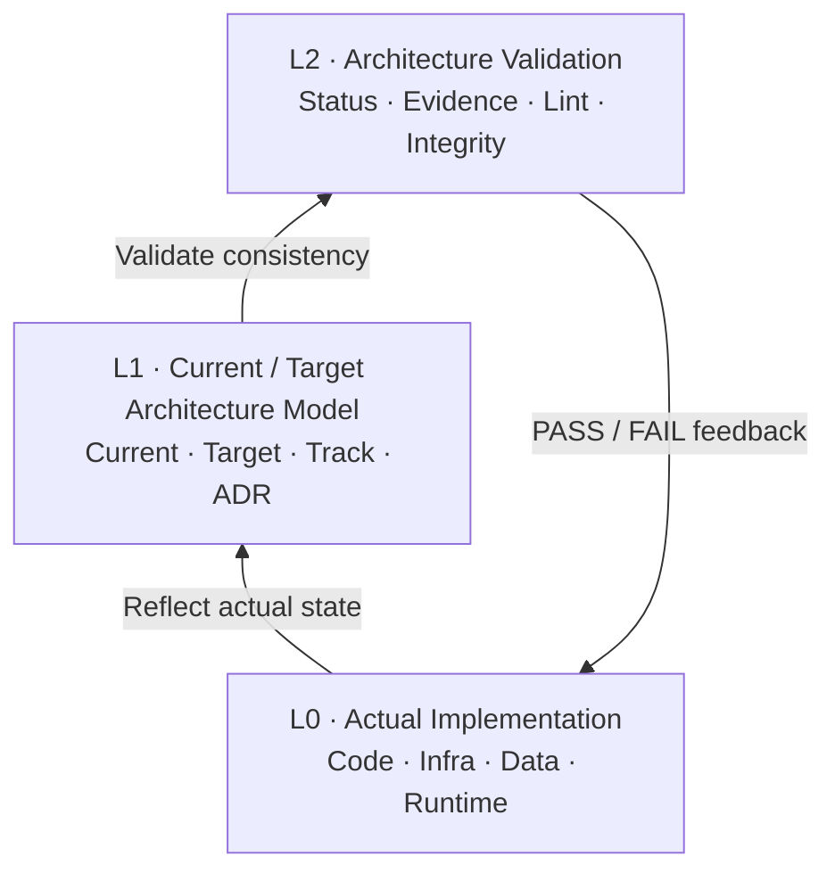
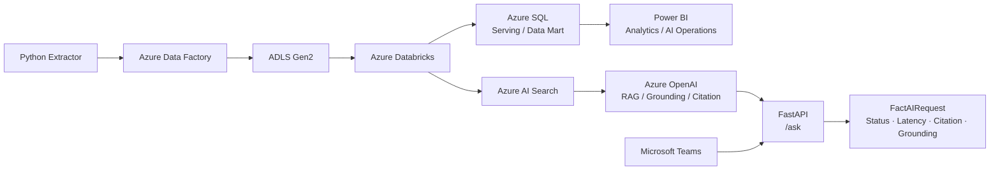
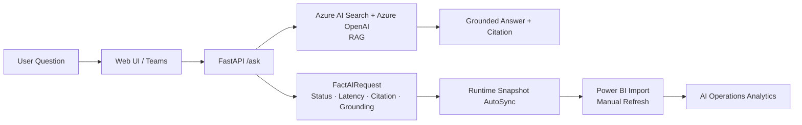
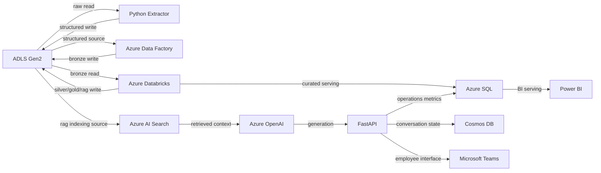
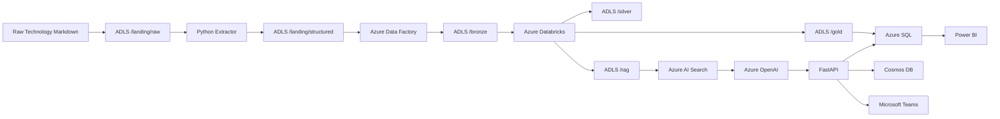
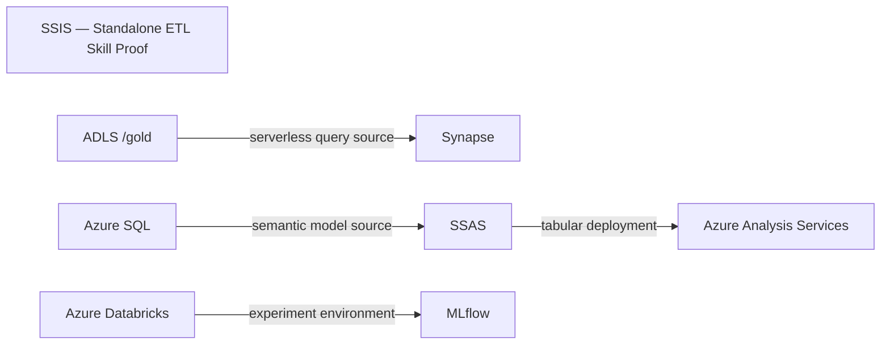

# TechScope Dynamic Architecture Portfolio

> Generated automatically from the current TechScope Source of Truth.  
> Generated UTC: `2026-08-19T05:55:41.813242+00:00`

## 1. Purpose

TechScope uses Dynamic Architecture so architecture documentation follows the verified implementation state rather than becoming an isolated static artifact.

## 2. Dynamic Architecture — 3 Layer Model



## 3. Current As-Built Architecture



## 4. AI Operations Feedback Loop



## 5. Current Architecture — Source of Truth Excerpt

```mermaid
flowchart LR
```

## 6. Target Architecture — Source of Truth Excerpt



## 7. Component Status

| Component | Current Status |
|---|---|
| CMP_ADLS | Prototype |
| CMP_PYTHON | Prototype |
| CMP_ADF | Prototype |
| CMP_DATABRICKS | Prototype |
| CMP_AZURE_SQL | Prototype |
| CMP_POWER_BI | In Progress |
| CMP_AI_SEARCH | Prototype |
| CMP_AZURE_OPENAI | Prototype |
| CMP_FASTAPI | Prototype |
| CMP_COSMOS | Planned |
| CMP_TEAMS | Planned |
| CMP_SSIS | Planned |
| CMP_SYNAPSE | Planned |
| CMP_SSAS | Planned |
| CMP_AAS | Planned |
| CMP_MLFLOW | Planned |
| `CMP_ADLS` | Implemented |
| `CMP_PYTHON` | Prototype |
| `CMP_ADF` | Implemented |
| `CMP_DATABRICKS` | Implemented |
| `CMP_AZURE_SQL` | Implemented |
| `CMP_POWER_BI` | Implemented |
| `CMP_AI_SEARCH` | Implemented |
| `CMP_AZURE_OPENAI` | Implemented |
| `CMP_FASTAPI` | Implemented |
| `CMP_COSMOS` | Implemented |
| `CMP_TEAMS` | Implemented |
| CMP_ADLS | Implemented |
| CMP_ADF | Implemented |
| CMP_DATABRICKS | Implemented |
| CMP_AZURE_SQL | Implemented |
| CMP_POWER_BI | Implemented |
| CMP_AI_SEARCH | Implemented |
| CMP_AZURE_OPENAI | Implemented |
| CMP_FASTAPI | Implemented |
| CMP_COSMOS | Implemented |
| CMP_TEAMS | Implemented |

## 8. Evidence Model

| Evidence Type | Occurrences |
|---|---:|
| SOURCE | 19 |
| EXECUTION | 18 |
| OUTPUT | 15 |

```text
Actual Implementation
  -> Evidence
  -> Component Status
  -> Current Architecture
  -> Validation / PASS or FAIL
```

## 9. Architecture Diagrams Already Defined in Source of Truth

### Source Diagram 1

```mermaid
flowchart LR
```

### Source Diagram 2


### Source Diagram 3



### Source Diagram 4



## 10. Generated Diagram Files

- `docs/portfolio/diagrams/01_dynamic_architecture_3layer.mmd`
- `docs/portfolio/diagrams/02_current_as_built_architecture.mmd`
- `docs/portfolio/diagrams/03_ai_operations_feedback_loop.mmd`

## 11. Generated Result

- `results/latest/dynamic-architecture-export.json`

## 12. Source Integrity Manifest

- `docs/status.md` — SHA-256 `91c27732dab40b911dbc636c9aeac8a7d853eb3fc546f9ee210be0ca8ab22e5e` — 5,647 bytes
- `docs/architecture.md` — SHA-256 `69719fe7b9dfee65cc3270f081ee87cd7e86bd900b76c364e56eecba58834881` — 3,155 bytes
- `docs/evidence.md` — SHA-256 `92d23765a492a30842b1db2015fcdd66c88a9995bb241c2136da8e6ff844065d` — 6,206 bytes

Frozen Baseline candidates checked: **1**

## 13. Export Contract

**Authoritative inputs**
- `docs/status.md`
- `docs/architecture.md`
- `docs/evidence.md`

**Safety**
- Frozen Baseline documents are read-only.
- Source of Truth documents are read-only.
- Azure resources are neither created nor deleted.
- Secrets are not persisted.
